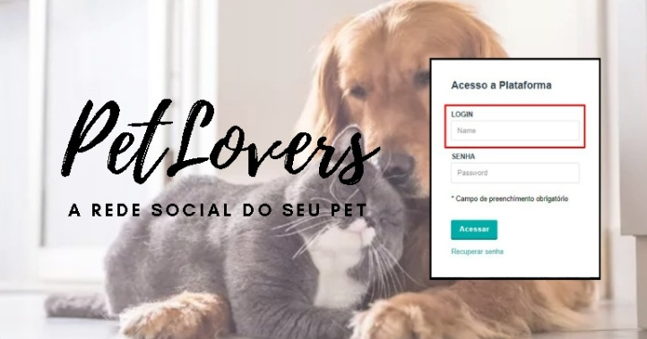
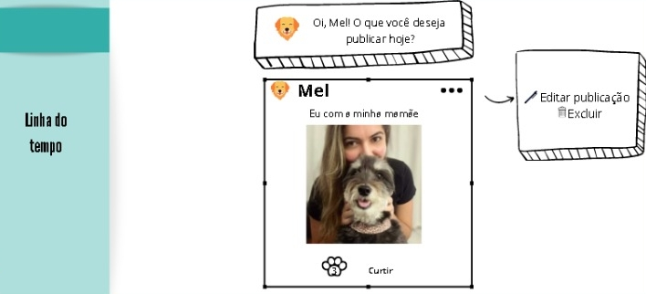

# PetLovers 🐶💛🐱

## Índice
* [1. Resumo do projeto](#1-resumo-do-projeto)
* [2. Definição de Persona](#2-definição-de-Persona)
* [3. Histórias de usuários](#3-Histórias-de-Usuários)
* [4. Protótipo](#4-Protótipo)
* [5. Planning](#5-Planning)

## 1. Resumo do Projeto

PetLovers é uma rede social direcionada a pessoas que amam animais. Nela o usuário pode postar curiosidades, dicas e qualquer coisa que seja relacionada ao mundo pet, além de conseguir editar, excluir a sua publicação e curtir as postagens de outros usuários.
Para acessar 
 

## 2. Definição de Persona

Para validar nossa persona e criarmos as histórias de usuários, elaboramos algumas perguntas e enviamos para que alguns usuários respondessem.

## Personas

## 3. Histórias de usuários

•	"Eu como usuário, gostaria de ter um cadastro em uma rede social para quem ama pets"

•	"Eu como usuário acho interessante ter uma rede social para compartilhar dicas e curiosidades sobre o mundo pet"

## 4. Protótipo de baixa fidelidade

 

## 5. Planning

[Clique aqui](https://trello.com/b/vohVnB5p/social-network) para acessar o planejamento para o desenvolvimento deste projeto.

💻🙎
Projeto realizado por Karina Ferreira Santos,Karine Venerando e Larissa Alborghette.
